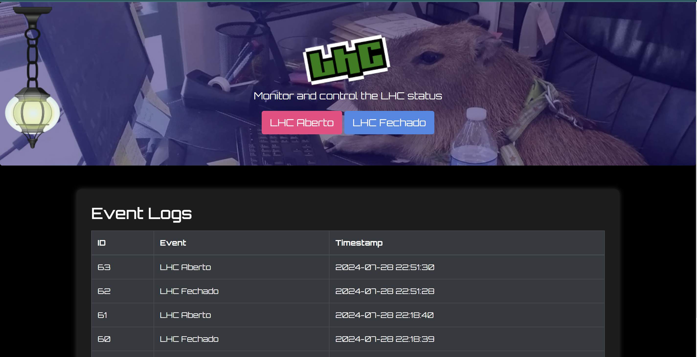

---

# Status Bot

## Descrição

O **Status Bot** é uma aplicação Flask para monitorar e controlar o status do LHC (Laboratorio Hacker de Campinas). Ele exibe o estado atual do LHC (aberto ou fechado) e mantém um registro de eventos em um banco de dados SQLite. A interface do usuário inclui uma imagem de fundo, botões para alternar o estado do LHC, e uma lâmpada que indica o estado atual. Além disso, a interface tem uma animação de transição e reproduz um som de clique ao mudar o estado.




| | |
|:-------------------------:|:-------------------------:|
| <img src="static/images/frontend-status.gif" | <img src="static/images/status_lamp.gif" |


## Funcionalidades

- Exibe o estado atual do LHC (aberto ou fechado).
- Botões para alternar entre os estados do LHC.
- Lâmpada indicadora de estado no canto superior esquerdo.
- Registro de eventos em um banco de dados SQLite.
- Imagem de fundo com sobreposição azul opaca.
- Som de clique ao mudar o estado do LHC.

## Requisitos

- Python 3.x
- Flask

## Instalação

1. Clone o repositório:
    ```bash
    git clone https://github.com/lhc/hackerspace-status-webapp.git
    cd hackerspace-status-webapp
    ```

2. Crie um ambiente virtual e ative-o:
    ```bash
    python3 -m venv venv
    source venv/bin/activate
    ```

3. Instale as dependências:
    ```bash
    pip install Flask
    ```

4. Crie a estrutura de pastas para `static/images` e `static/sounds`, e adicione as imagens e o arquivo de som correspondentes:

    - `static/images/lhc.png`
    - `static/images/lampon.png`
    - `static/images/lampoff.png`
    - `static/sounds/mixkit-light-pull-switch-1891.wav`

5. Execute a aplicação Flask:
    ```bash
    python app.py
    ```

6. Acesse a aplicação no navegador:
    ```
    http://127.0.0.1:5000/
    ```

## Estrutura do Projeto

```
status_bot
├── app.py
├── static
│   ├── css
│   │   └── style.css
│   ├── images
│   │   ├── lhc.png
│   │   ├── lampon.png
│   │   └── lampoff.png
│   └── sounds
│       └── mixkit-light-pull-switch-1891.wav
├── templates
│   └── index.html
└── logs.db
```

## Uso

- Acesse a aplicação no navegador para visualizar o estado atual do LHC.
- Use os botões "LHC Aberto" e "LHC Fechado" para alternar o estado do LHC.
- A lâmpada no canto superior esquerdo indicará o estado atual do LHC.
- A tabela de logs exibirá os últimos 5 eventos registrados.

## Contribuição

1. Faça um fork do projeto.
2. Crie uma branch para sua feature (`git checkout -b feature/sua-feature`).
3. Commit suas alterações (`git commit -m 'Adiciona sua feature'`).
4. Faça push para a branch (`git push origin feature/sua-feature`).
5. Abra um Pull Request.

## Licença

Este projeto está licenciado sob a MIT License. Veja o arquivo [LICENSE](LICENSE) para mais detalhes.

https://www.instructables.com/Knife-Switch/
---
